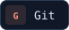
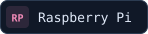
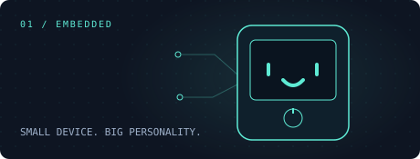
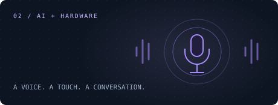
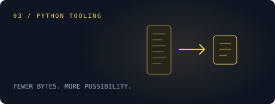
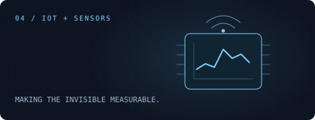

  

  <b>Python tools. Intelligent devices. Ideas you can actually use.</b> 
  I build across software and hardware, turning experiments into working projects.

  <a href="#-the-toolkit">The toolkit</a> &nbsp; / &nbsp;
  <a href="#-selected-builds">Selected builds</a> &nbsp; / &nbsp;
  <a href="#-the-contribution-snake">Contribution snake</a> &nbsp; / &nbsp;
  <a href="https://www.linkedin.com/in/rudra-raut-1862a31bb/">Connect on LinkedIn ↗</a>

### ⌘ The toolkit

  
  
  
  
  

  
  
  
  
  

**What connects my work:** automation with Python, AI-powered interactions, embedded devices, and tools that solve practical problems.

### ◈ Selected builds

<table>
  <tr>
    <td width="50%" valign="top">
      
      <b><a href="https://github.com/Rudrarauttt/Echo-Off_V1">Echo Off ↗</a></b> 
      A pocket-sized gadget with an expressive face, a menu-driven interface, and a rotary-controlled Pong game.  
      C++ · Arduino · Raspberry Pi Pico W
    </td>
    <td width="50%" valign="top">
      
      <b><a href="https://github.com/Rudrarauttt/Happiness-Guru-">Happiness Guru ↗</a></b> 
      An AI voice companion connecting a Raspberry Pi, touch input, a status display, and speech synthesis.  
      Python · AI voice · Raspberry Pi
    </td>
  </tr>
  <tr>
    <td width="50%" valign="top">
      
      <b><a href="https://github.com/Rudrarauttt/Data-Compression">Data Compression ↗</a></b> 
      A Python project exploring data compression through a desktop interface built with Tkinter.  
      Python · Tkinter · Compression
    </td>
    <td width="50%" valign="top">
      
      <b><a href="https://github.com/Rudrarauttt/AQ-Intel-Node">AQ Intel Node ↗</a></b> 
      An ESP32 air-quality node combining environmental sensors, GPS, a TFT display, and a local web server.  
      C++ · ESP32 · Environmental sensing
    </td>
  </tr>
</table>

<a href="https://github.com/Rudrarauttt?tab=repositories">Explore my public repositories →</a>

### ↗ On the workbench

<picture>
  <source media="(prefers-color-scheme: dark)" srcset="https://raw.githubusercontent.com/Rudrarauttt/Rudrarauttt/output/activity-dark.svg" />
  <source media="(prefers-color-scheme: light)" srcset="https://raw.githubusercontent.com/Rudrarauttt/Rudrarauttt/output/activity-light.svg" />
  
</picture>

### ⌁ The contribution snake

My contribution history, one square at a time. An animated replay generated from my GitHub contribution graph.

<picture>
  <source media="(prefers-color-scheme: dark)" srcset="https://raw.githubusercontent.com/Rudrarauttt/Rudrarauttt/output/github-snake-dark.svg" />
  <source media="(prefers-color-scheme: light)" srcset="https://raw.githubusercontent.com/Rudrarauttt/Rudrarauttt/output/github-snake.svg" />
  
</picture>

Updated daily with GitHub Actions · Light + dark themes · Snake by <a href="https://github.com/Platane/snk">Platane/snk</a>

---

<b>Build. Test. Learn. Repeat.</b> Have an idea at the intersection of code and hardware? <a href="https://www.linkedin.com/in/rudra-raut-1862a31bb/">Let's connect.</a>

